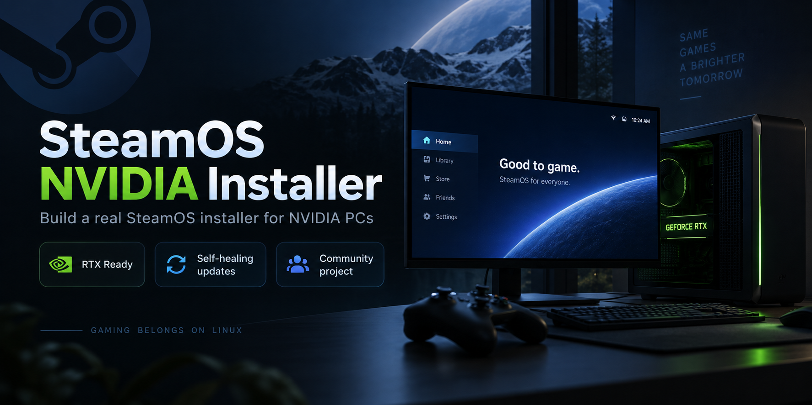

# SteamOS NVIDIA Installer



**Your RTX PC. Your Steam library. SteamOS.**

Turn Valve's official recovery image into a bootable SteamOS installer for a PC
with NVIDIA graphics. Start from USB, install on an internal or external USB disk, and use Game Mode
with a controller or switch to Desktop Mode when you need a full Linux desktop.

[Get started](https://github.com/60plus/steamos-nvidia-installer/wiki) · [Build your USB image](https://github.com/60plus/steamos-nvidia-installer/wiki/Build-the-USB-image) · [Troubleshooting](https://github.com/60plus/steamos-nvidia-installer/wiki/Troubleshooting)

## Built for a living-room PC

- **NVIDIA ready:** builds the open kernel driver for the exact kernel in your recovery image.
- **Change drivers from the desktop:** choose a compatible NVIDIA release and prepare it without rebuilding your USB installer.
- **Updates from Steam:** rebuilds the selected NVIDIA driver for the updated OS before completing repair.
- **A comfortable first start:** new display profiles start with HDR off. Turn it on later for a compatible display; your choice is preserved.
- **Controller friendly:** uses SteamOS controller support by default, with optional xpadneo for controllers that need it.
- **Install or refresh:** desktop shortcuts offer a fresh installation or an OS reinstall that keeps the existing SteamOS data partition.
- **Help when you need it:** optional Safe Graphics and local diagnostic reports make troubleshooting easier.
- **Remote Play in both directions:** build with capture and receiver color fixes, plus an NVIDIA hardware-encoding bridge.
- **Useful performance readings:** the corrected overlay shows GPU metrics and detected CPU/GPU names.
- **Installer tools stay current:** configured images include a desktop updater for signed project fixes.
- **Built on your machine:** the original recovery image is kept intact. Choose a driver version and produce your own USB image.

## What you need

An NVIDIA RTX desktop PC, UEFI with Secure Boot disabled, a USB drive of at least
16 GB, and a Linux machine to build the image. Intel and AMD desktop CPUs are
both in scope. Hybrid graphics laptops need separate validation.

**GeForce GTX 10xx and older cards are not supported by this installer.** It uses
NVIDIA's open kernel modules, which require Turing or newer. GTX 16xx and RTX
cards fall within that architecture range; the selected driver must also support
the exact GPU. See [NVIDIA's GPU support documentation](https://github.com/NVIDIA/open-gpu-kernel-modules#compatible-gpus).

Fresh installation erases the selected disk. Read the
[preparation guide](https://github.com/60plus/steamos-nvidia-installer/wiki/Before-you-start) before writing the USB or installing.

**Display tip:** if HDMI gives you a green screen, flickering or trouble with HDR
and VRR, try a direct DisplayPort connection when available. See the [display troubleshooting guide](https://github.com/60plus/steamos-nvidia-installer/wiki/Troubleshooting#hdr-and-hdmi).

## Quick start

Build the complete installer with the overlay, Remote Play fixes and desktop
updater included. Start with Linux or a [Linux VM on Windows](https://github.com/60plus/steamos-nvidia-installer/wiki/Build-on-Windows).
Allow at least 50 GiB free on the Linux work filesystem after downloading the input.

1. Download Valve's **SteamOS 3.8.14 recovery image** through the
   [official recovery page](https://help.steampowered.com/en/faqs/view/65B4-2AA3-5F37-4227#install)
   and unpack it. The current complete builder requires this baseline.
2. Clone this repository using the HTTPS URL from its Code menu. In the checkout run:

   ```bash
   sudo bash tools/build-complete.sh /path/to/recovery.img
   ```

3. Write the resulting `recovery-nvidia-usbinstall.img` to a USB drive, boot the PC
   and choose **Install SteamOS (NVIDIA)** on the desktop.

The script prepares the build environment and components for you, preserves the
original image and writes a SHA256 checksum beside the result. The project does
not distribute Valve's recovery image or a complete SteamOS image.

See the [complete build guide](https://github.com/60plus/steamos-nvidia-installer/wiki/Build-the-USB-image)
for prerequisites and options, then [installation instructions](https://github.com/60plus/steamos-nvidia-installer/wiki/Install-and-first-boot).

## Help improve PC support

Found a problem or tried a new setup? Share a bug report, suggest a feature, or
send a hardware compatibility report. The [diagnostics guide](https://github.com/60plus/steamos-nvidia-installer/wiki/Diagnostics-and-test-results)
explains what to include.

Based on [28allday/steamos-nvidia-installer](https://github.com/28allday/steamos-nvidia-installer),
with additional PC integration, recovery checks and desktop maintenance tools.
The original MIT license and copyright notice are retained. See
[How it works](https://github.com/60plus/steamos-nvidia-installer/wiki/How-it-works) for the architecture.

Independent project, not affiliated with or endorsed by Valve or NVIDIA.
The build instructions use Valve's official recovery download as the starting point.
See [LICENSE](LICENSE).
