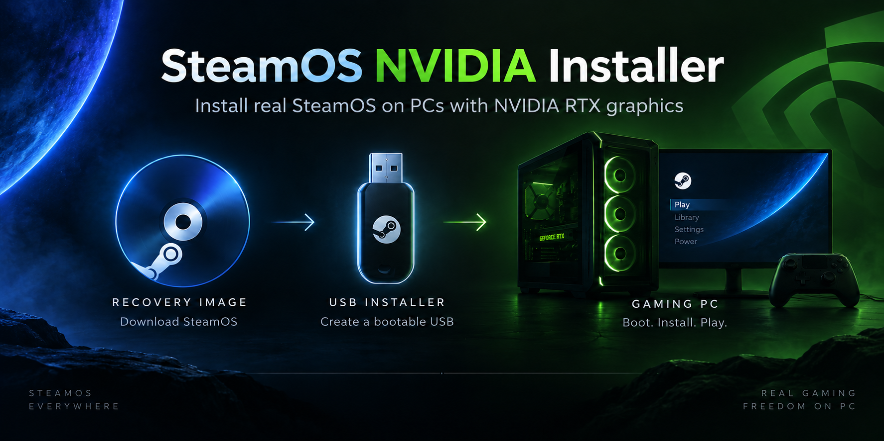

# SteamOS NVIDIA manual

Build a USB installer, install SteamOS on your NVIDIA PC, and keep it running.
Choose the guide for what you want to do.

| Task | Guide |
|---|---|
| Understand the architecture and contribute | [How it works](How-it-works.md) |
| Check the hardware, disk space and tools you need | [Before you start](Before-you-start.md) |
| Create and write an installer USB | [Build the USB image](Build-the-USB-image.md) |
| Install, set up your display and pair a controller | [Install and first boot](Install-and-first-boot.md) |
| Update installer tools without reinstalling | [Installer updates](Installer-Updates.md) |
| Update SteamOS or reinstall the OS | [Updates and recovery](Updates-and-recovery.md) |
| Fix a display, controller, audio or update problem | [Troubleshooting](Troubleshooting.md) |
| Try an optional recovery session | [Safe Graphics](Safe-Graphics.md) |
| Collect logs for a support request | [Diagnostics](Diagnostics-and-test-results.md) |

Start with one display connected directly to the NVIDIA card. Keep your installer
USB after installation so you can reach the recovery desktop if the installed
system cannot start.

This manual describes the code on the branch you are reading. Fresh installation
erases the selected disk. The Upgrade option is intended for an existing SteamOS
layout and does not replace a backup.

For a Windows host, see [Build on Windows](Build-on-Windows.md). For a Bazzite
host, see [Build on Bazzite](Build-on-Bazzite.md).
